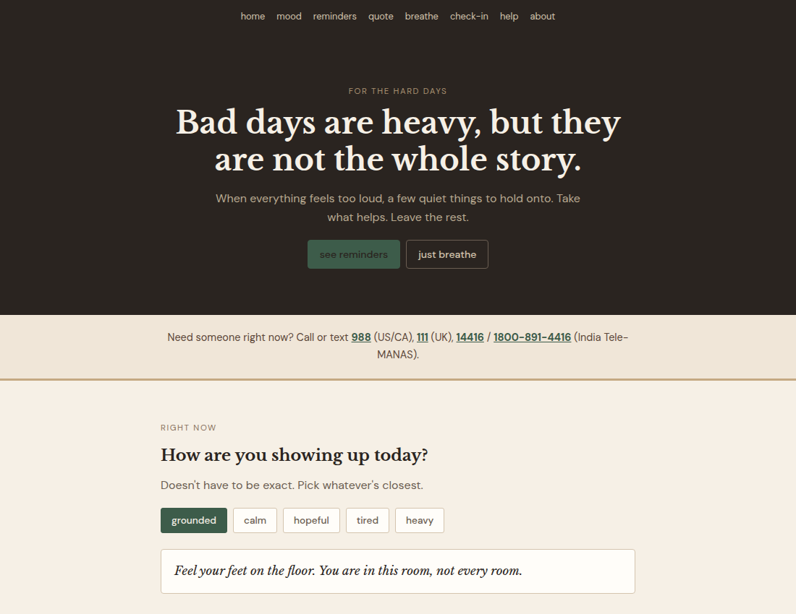

# Proof of Better Days

a quiet page for hard days.

reminders, a breathing thing, mood-based quotes, a tiny check-in list, and help line numbers. no accounts, no tracking.



## files

```
index.html
style.css
app.js
```

open `index.html` in a browser, or serve the folder:

```
python3 -m http.server 8080
```

## what's on it

- mood buttons that change the quote
- rotating lines for grounded / calm / hopeful / tired / heavy
- breathing circle
- optional check-in list (saves in localStorage)
- crisis numbers for US/CA, UK, India + IASP link

## note

this is not therapy. if things are bad, call a real person — numbers are on the page.
